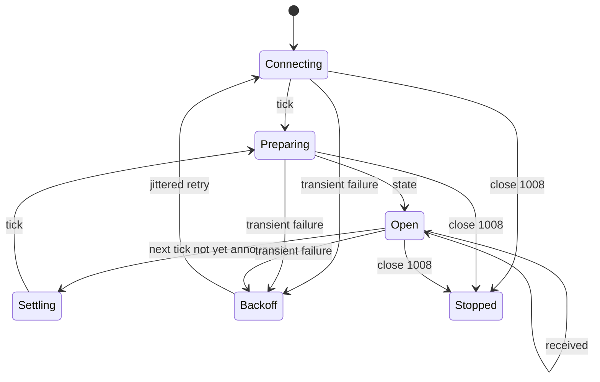

# Reliable command loop

## Recommended client state

Keep these values independently:

```text
announced_tick
latest_state
latest_received.AGENT
latest_received.MANUAL
connection_phase
reconnect_attempt
terrain_memory
```

Do not treat a WebSocket connection as the source of truth. It is a transport
for the latest authoritative snapshot and receipt state.

## State machine



The server can be silent during settlement. Silence is not evidence of a broken
connection; protocol Ping/Pong maintains liveness.

## Decision timing

The server opens one global 15-second window before publishing states. Your
Agent never knows the exact deadline and may receive less than 15 seconds.

Recommended behavior:

1. Precompute reusable indexes and strategy state outside the window.
2. Begin calculation immediately on `state`.
3. Use an internal deadline much shorter than 15 seconds.
4. Submit a safe partial strategy as a **complete plan** rather than miss the
   window.
5. Do not spam retries after `COMMAND_WINDOW_CLOSED`.

## Plan replacement

Submitting:

```json
{
  "tick": 80,
  "unit_actions": {
    "aaaaaaaa-aaaa-4aaa-8aaa-aaaaaaaaaaaa": {"type": "MOVE", "direction": "UP"},
    "bbbbbbbb-bbbb-4bbb-8bbb-bbbbbbbbbbbb": {"type": "WAIT"}
  }
}
```

and later submitting:

```json
{
  "tick": 80,
  "unit_actions": {
    "aaaaaaaa-aaaa-4aaa-8aaa-aaaaaaaaaaaa": {"type": "MOVE", "direction": "LEFT"}
  }
}
```

means Unit B is no longer explicitly present in the Agent plan. It resolves to
`WAIT` unless Manual provides an action. The server does not preserve Unit B
from the earlier Agent request.

## Safe retry matrix

| Outcome | Retry? | Behavior |
|---|---|---|
| Network failed before a response | Yes | Retry the exact body with the same idempotency key. |
| `202 Accepted` | No | Wait for `received`; the plan is persisted. |
| Same key replay | No extra effect | Original response is returned; no duplicate `received`. |
| `TICK_NOT_READY` | Later | Wait for `state` or reconnect. |
| `COMMAND_WINDOW_CLOSED` | No for that Tick | Wait for the next `state`. |
| `TICK_MISMATCH` | Recompute | Never rewrite only the Tick number on stale state. |
| `INVALID_COMMAND` | Fix once | Correct the full plan; old valid plan remains active. |
| `COMMAND_RATE_LIMITED` | No for that source/Tick | Preserve the latest valid plan. |
| `UNAUTHORIZED` or WS `1008` | Stop | Replace the credential or fix the client before retrying. |

## Reconnect snapshot

During OPEN, a reconnect returns in this order:

1. current `tick`;
2. complete current `state`;
3. latest `received` for `AGENT`, if any;
4. latest `received` for `MANUAL`, if any.

The command window is not extended. Replace local values with the snapshot.

During state preparation, reconnect returns `tick` immediately and `state` when
ready. During settlement, it remains quiet until the next real Tick.

## Backoff

Start at 250 ms, double after each failed attempt, cap at 5 seconds, and add
random jitter. Reset to 250 ms after a successful connection. Do not reconnect
after close code `1008`.

## Heartbeats

The server sends protocol Ping frames every 20 seconds and requires a Pong
within 60 seconds. Standard WebSocket libraries answer automatically.

Do not send a custom heartbeat JSON message. The server accepts no client
business frames and closes policy violations with code `1008`.
