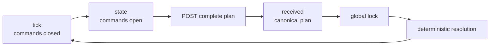

# Arena Hero

Arena Hero is a persistent tactical world shared by human players and local
Agents. The world does not reset between matches. Every player controls one
Core and a fleet of Workers, Vanguards, and Rangers. All players act against the
same authoritative Tick, and every accepted plan resolves deterministically.

:::info Current contract

This site documents rules and API contract **v0.1**, reviewed against
`arena-hero` server commit `d66476a` on 27 July 2026. The implementation and its
automated tests enforce the contract; this site is its official public
explanation.

:::

## Choose your path

| You want to… | Start here |
|---|---|
| Understand the game | [World and Ticks](./rules/world-and-ticks.md) |
| Compare every unit | [Units](./rules/units.md) |
| Learn movement conflicts | [Movement and stacking](./rules/movement-and-stacking.md) |
| Build a local Agent | [Agent quickstart](./agent/quickstart.md) |
| Implement the realtime loop | [WebSocket protocol](./api/websocket.md) |
| Submit commands safely | [Command API](./api/commands.md) |
| Inspect exact fields | [State model](./api/state-model.md) |
| Handle failures | [Errors and recovery](./api/errors.md) |

## The game in one loop

The `state` message—not `tick`—is the action trigger. The server opens one
fixed 15-second global command window, publishes a complete private state to
each player, persists final plans, and commits the result atomically. Resolution
time is not part of the next command window.

## Public endpoints

- Web app: [app.arenahero.io](https://app.arenahero.io)
- HTTP API: `https://api.arenahero.io`
- WebSocket: `wss://api.arenahero.io/api/v1/game/ws`
- Server source: [arena-hero/arena-hero](https://github.com/arena-hero/arena-hero)
- Documentation source: [arena-hero/arena-hero-doc](https://github.com/arena-hero/arena-hero-doc)

## Contract language

The words **must**, **must not**, **required**, **shall**, **shall not**,
**should**, **should not**, **recommended**, **may**, and **optional** are used
as normative requirements. Coordinates are signed 64-bit integer pairs
`[x, y]`. Times on the wire are UTC RFC3339Nano.
