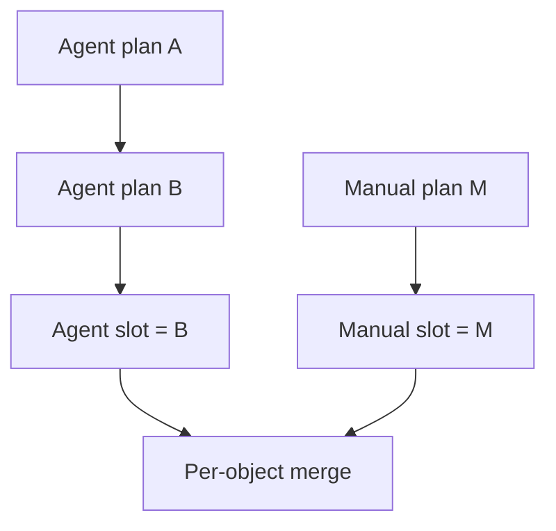

# Commands and priority

## Two independent source slots

Every player has one `AGENT` plan slot and one `MANUAL` plan slot per Tick.

```text
Manual explicit action > Agent explicit action > WAIT
```

- An Agent plan is the complete automated plan. Objects omitted by the Agent
  resolve to `WAIT` unless Manual supplies an explicit action.
- A Manual plan is the complete set of human overrides. Objects omitted by
  Manual fall back to Agent.
- Manual must send an explicit `WAIT` to force an object not to act.
- All Agent clients for one player share the same Agent slot.
- Several browser tabs share the same Manual slot.

## Complete replacement

Every successful POST replaces the entire earlier plan from that same source.
Plans are never patched or merged server-side.



If an Agent wants to change one Unit while preserving all other actions, it must
resend the full desired Agent plan.

## Static and dynamic validation

Static validation happens before persistence:

- strict JSON object and no unknown fields;
- positive Tick;
- canonical lowercase Unit UUID keys;
- every referenced acting Unit is owned by the player;
- action type is allowed for that Unit;
- required fields are present;
- unrelated action fields are absent.

One static issue rejects the full request atomically. The previous valid plan
remains unchanged.

Dynamic conditions resolve later:

- target moved;
- destination became occupied;
- movement was contested;
- resources became insufficient;
- Beacon was won by a lower UUID;
- Ranger line became blocked.

Dynamic failure does not invalidate the POST. It appears in the next
`state.events`.

## Ordering and rate limit

Valid requests for the same `(player, tick, source)` serialize in gate-entry
order. A later persisted full plan replaces an earlier one. The protocol has no
client-supplied version number.

Each source slot processes at most 64 new submissions per Tick after idempotency
precheck; both valid and statically invalid new requests count. Additional
requests return `429 COMMAND_RATE_LIMITED` and preserve the last valid plan.

## Idempotency and receipts

Every command request has an `Idempotency-Key`.

- Same key + same body returns the original HTTP response.
- Same key + different body returns `IDEMPOTENCY_CONFLICT`.
- A replay does not broadcast a second `received`.

On new successful persistence:

1. HTTP returns minimal `202 Accepted` receipt metadata.
2. Every live connection for that player receives a canonical full
   `received.plan`.
3. Reconnecting during the same OPEN Tick restores the latest receipt from each
   source.

Receipts clear at the next Tick and are not a plan-history service.
