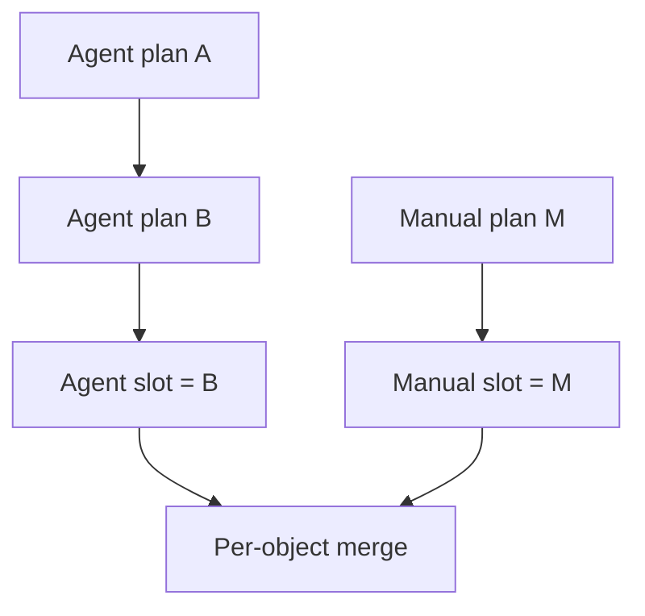

# Commands and priority

## Two independent source slots

Each player gets one `AGENT` plan slot and one `MANUAL` plan slot per Tick, and
they are merged per object:

```text
Manual explicit action > Agent explicit action > WAIT
```

- The Agent plan holds automated actions. Leave an object out and it does `WAIT`,
  unless Manual has something for it.
- The Manual plan holds human overrides. Leave an object out and it falls back to
  the Agent.
- To stop an Agent action, Manual has to send an explicit `WAIT` — omitting the
  object is not enough.
- All of one player's Agent clients share a single Agent slot.
- All of one player's browser tabs share a single Manual slot.

## A new plan replaces the old one

Each successful POST replaces whatever that source sent before. The server never
patches or merges the two.



So if an Agent wants to change one Unit and leave the others doing what they were
doing, it has to send those other actions again too.

## Static and dynamic validation

Static validation runs before anything is persisted, and checks that:

- the body is one JSON object with no unknown fields;
- the Tick is positive;
- Unit UUID keys are lowercase and hyphenated;
- every acting Unit referenced belongs to the player;
- the action type is allowed for that Unit;
- required fields are present;
- unrelated action fields are absent.

A single problem rejects the whole request atomically, and your previous valid plan
is left exactly as it was.

Dynamic conditions are a different matter — they can only be settled later, at
resolution:

- the target moved;
- the destination filled up;
- the movement was contested;
- resources ran short;
- a lower UUID won the Beacon;
- an obstacle blocked the Ranger's line.

None of these invalidate the POST. They show up in the next `state.events`.

## Ordering and rate limit

Valid requests for the same `(player, tick, source)` are serialized in the order
they enter the gate, and each stored plan replaces the one before it. There is no
client-supplied version number in the protocol.

Each source slot accepts at most 64 new submissions per Tick, counted after the
idempotency precheck — valid and statically invalid requests both count. Anything
beyond that gets `429 COMMAND_RATE_LIMITED`, and your last valid plan stands
untouched.

## Idempotency and receipts

Every command request carries an `Idempotency-Key`.

- Same key, same body: you get the original HTTP response back.
- Same key, different body: `IDEMPOTENCY_CONFLICT`.
- A replay does not broadcast a second `received`.

Once the server has stored a new plan:

1. HTTP returns a minimal `202 Accepted` with receipt metadata.
2. Every live connection for that player gets the stored plan in `received.plan`.
3. Reconnecting during the same OPEN Tick restores the latest receipt from each
   source.

Receipts are cleared at the next Tick. This is not a plan-history service.
