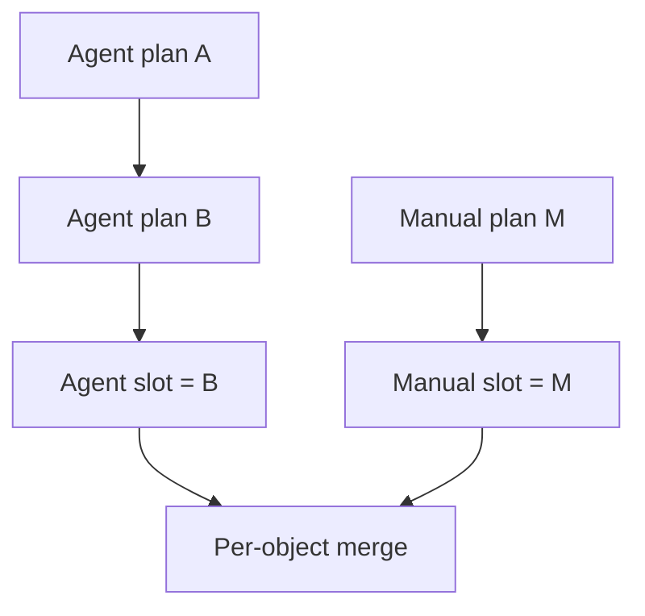

# Commands and priority

## Two independent source slots

Every player has one `AGENT` plan slot and one `MANUAL` plan slot per Tick.

```text
Manual explicit action > Agent explicit action > WAIT
```

- The Agent plan contains automated actions. An omitted object uses `WAIT`
  unless Manual supplies an action.
- The Manual plan contains human overrides. An omitted object falls back to Agent.
- Manual sends an explicit `WAIT` when the player wants to stop an Agent action.
- All Agent clients for one player share the same Agent slot.
- Several browser tabs share the same Manual slot.

## A new plan replaces the old one

Every successful POST replaces the earlier plan from that source. The server
does not patch or merge it with the previous plan.



To change one Unit and keep the others acting, the Agent must send those other
actions again.

## Static and dynamic validation

Static validation happens before persistence:

- one JSON object with no unknown fields;
- positive Tick;
- lowercase, hyphenated Unit UUID keys;
- every referenced acting Unit is owned by the player;
- action type is allowed for that Unit;
- required fields are present;
- unrelated action fields are absent.

One static issue rejects the full request atomically. The previous valid plan
remains unchanged.

Dynamic conditions resolve later:

- target moved;
- destination became occupied;
- movement was contested;
- resources became insufficient;
- Beacon was won by a lower UUID;
- Ranger line became blocked.

Dynamic failure does not invalidate the POST. It appears in the next
`state.events`.

## Ordering and rate limit

Valid requests for the same `(player, tick, source)` serialize in gate-entry
order. A later stored plan replaces an earlier one. The protocol has no
client-supplied version number.

Each source slot processes at most 64 new submissions per Tick after idempotency
precheck; both valid and statically invalid new requests count. Additional
requests return `429 COMMAND_RATE_LIMITED` and preserve the last valid plan.

## Idempotency and receipts

Every command request has an `Idempotency-Key`.

- Same key + same body returns the original HTTP response.
- Same key + different body returns `IDEMPOTENCY_CONFLICT`.
- A replay does not broadcast a second `received`.

After the server stores a new plan:

1. HTTP returns minimal `202 Accepted` receipt metadata.
2. Every live connection for that player receives the stored plan in
   `received.plan`.
3. Reconnecting during the same OPEN Tick restores the latest receipt from each
   source.

Receipts clear at the next Tick and are not a plan-history service.
