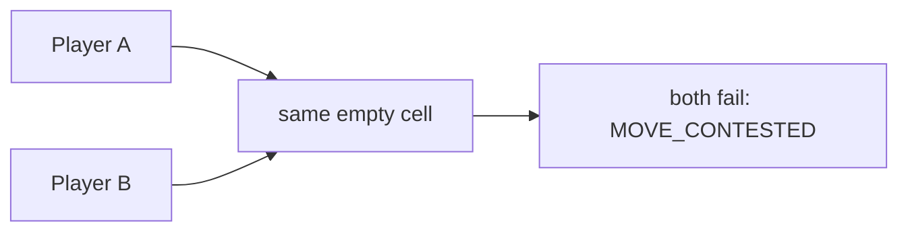

# Movement and stacking

## Base constraints

- A Unit moves at most one cell per Tick.
- Movement is cardinal: `UP`, `DOWN`, `LEFT`, or `RIGHT`.
- Moving consumes the Unit's action, so it cannot attack or work in that Tick.
- Obstacles block all movement.
- Resource cells accept Units but not a migrating Core.
- A cell holds at most **two occupying entities**. Core, Worker, Vanguard, and
  Ranger each count as one.
- Objects from different players may not finish in the same cell.

The engine does not resolve movement one request at a time. It builds one global
dependency graph and decides all Unit moves and finishing Core migrations
together.

## Contested destinations

When multiple players attempt to enter the same destination, all competing
moves fail. Fleet size, submission time, and command source do not break the
tie.



When several objects from the **same** player compete for too few free slots,
available slots go to object UUIDs in ascending raw-byte order. Remaining moves
fail with `CELL_UNIT_LIMIT`. This rule is deterministic but should not be used
as a tactical timing mechanism; submit plans that respect expected capacity.

## Occupied destinations

An object may enter a cell if its current occupants all successfully leave and
the final capacity remains valid. This allows movement chains:

```text
A → B's old cell
B → C's old cell
C → empty cell
```

If `C` succeeds, the full chain succeeds. If any dependency cannot leave,
failure propagates backward.

If a cell contains two objects from one player, **both** original occupants
must successfully leave before an enemy can enter.

## Swaps and cycles

A two-object edge swap between different players always fails:

```text
A at [0,0] → [1,0]
B at [1,0] → [0,0]
```

Legal cycles of three or more positions can succeed when every final cell
respects ownership and capacity. On a cardinal square grid, the shortest common
cycle uses four cells.

## Core participation

A Core whose four-Tick migration completes contributes a real movement intent
to the same graph. A stationary Core is an occupied dependency that an enemy
cannot enter.

The fourth-Tick migration can fail because of:

- impassable terrain;
- signed-coordinate overflow;
- an occupant that does not leave;
- a contested destination;
- an enemy move into the same destination;
- final cell capacity.

Failure keeps the Core in its origin and clears migration progress.

## Browser route planning is not a server rule

The web client can choose a distant explored destination and calculate a route.
That route is local Manual automation: after every new `state`, the browser
recalculates and submits only the next single-step action. The server accepts
only `MOVE` and `START_MOVE`, never a multi-cell path.

If the browser closes, the stored route does not continue by itself.
