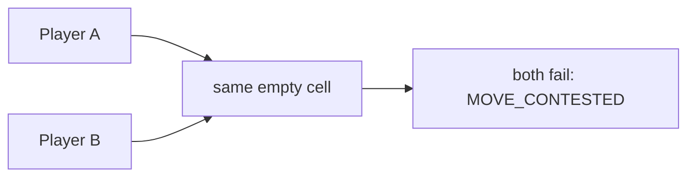

# Movement and stacking

## Base constraints

- A Unit moves at most one cell per Tick.
- Movement is cardinal only: `UP`, `DOWN`, `LEFT`, or `RIGHT`.
- Moving uses up the Unit's action, so a Unit that moves cannot attack or work
  that Tick.
- Obstacles block all movement.
- Resource cells take Units but turn away a migrating Core.
- A cell holds at most **two occupying entities**. Core, Worker, Vanguard, and
  Ranger each count as one.
- Two players' objects may never finish the Tick in the same cell.

Movement is not resolved one request at a time. The engine builds a single global
dependency graph and settles every Unit move and every finishing Core migration in
one pass.

## Contested destinations

If two players try to enter the same destination, both moves fail. Nothing breaks
the tie — not fleet size, not who submitted first, not which source the command
came from.



Within a **single** player's own objects the rule is different: when there are
more contenders than free slots, the slots go to the lowest object UUIDs in
ascending raw-byte order, and the rest fail with `CELL_UNIT_LIMIT`. It is
deterministic, but do not build tactics on it — plan around the capacity you
expect to have.

## Occupied destinations

You can move into an occupied cell as long as its current occupants all leave
successfully and the final capacity still works out. That is what makes chains
possible:

```text
A → B's old cell
B → C's old cell
C → empty cell
```

If `C` gets through, the whole chain gets through. If any link cannot leave, the
failure propagates backward down the chain.

One exception worth remembering: if a cell holds two objects from the same player,
**both** have to leave before an enemy can step in.

## Swaps and cycles

Two objects from different players trying to trade places across one edge always
fails:

```text
A at [0,0] → [1,0]
B at [1,0] → [0,0]
```

Longer cycles of three or more positions can succeed, provided every final cell
satisfies ownership and capacity. On a cardinal square grid the shortest cycle you
will actually see uses four cells.

## Core participation

A Core finishing its four-Tick migration enters the same graph with a real
movement intent. A Core standing still is just an occupied dependency that no
enemy can enter.

That fourth-Tick move can still fail, because of:

- impassable terrain;
- signed-coordinate overflow;
- an occupant that does not leave;
- a contested destination;
- an enemy moving into the same destination;
- final cell capacity.

When it fails, the Core stays where it started and its migration progress resets
to zero.

## Browser route planning is not a server rule

In the web client you can click a distant explored cell and get a route, but that
route is purely local Manual automation. After each new `state` the browser
recalculates and submits only the next single step. The server accepts `MOVE` and
`START_MOVE` and nothing else — never a multi-cell path.

Close the browser and the route stops with it.
