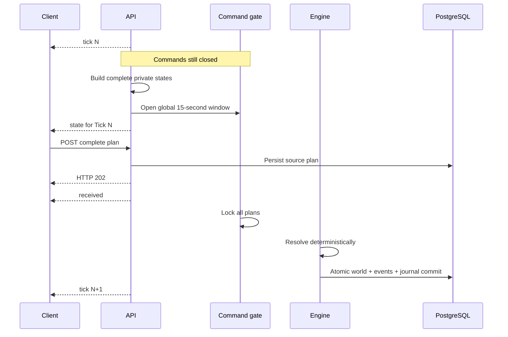

# World and Ticks

## One persistent world

- Every player shares one permanent two-dimensional square-grid world.
- There are no seasons, match resets, NPCs, monsters, or server-controlled
  fleets.
- One account owns at most one living Core at a time.
- Units and each generation of a Core use non-enumerable UUIDs. An object keeps
  its ID while alive; IDs are never reused after death.
- Enemy state never exposes account IDs, email addresses, or usernames.

Accounts activated while the world is resolving do not appear midway through a
snapshot. The server assigns a persistent `activation_tick`; the player enters
the world through deterministic respawn processing at that Tick.

## Deterministic infinite generation

The server generates 32×32 chunks from a permanent secret world seed and a
versioned HMAC-SHA256 contract. A client never receives the seed.

Important consequences:

- The same world, generator version, balance, and coordinates always produce
  the same terrain.
- Adjacent chunks share deterministic boundary passages.
- Every passable pocket connects to the chunk backbone; one-cell strategic
  chokepoints are allowed.
- `[0, 0]` and its route to the chunk backbone are always `EMPTY`, keeping the
  Champion Beacon globally reachable.
- A generator-contract mismatch prevents the service from starting. Changing
  generation semantics requires a new world database.

## Tick lifecycle

One logical Tick has a fixed command phase and a variable resolution phase.

The server window opens before states are published one player at a time. A
client receives the **remaining** portion of that global 15 seconds; receiving
`state` does not start a private 15-second timer. The protocol intentionally
does not expose `opened_at` or `deadline_at`.

`tick` announces that a logical Tick exists but commands are still closed.
`state` is the only action trigger.

## Resolution order

The order below is part of the protocol:

1. Lock the final valid Agent and Manual plans.
2. Charge upkeep and apply unpaid upkeep damage.
3. Resolve Unit movement and Core migrations that reach their fourth Tick.
4. Validate new Core `START_MOVE` actions.
5. Resolve Champion Beacon pickup and drop actions.
6. Resolve Worker harvest and deposit actions.
7. Resolve Core spawn and shield repair.
8. Freeze one immutable combat snapshot and accumulate every legal attack.
9. Apply damage simultaneously, remove destroyed objects, and resolve due
   respawns.
10. Atomically commit the world, events, statistics, journal, and new clock.
11. Announce the next Tick and prepare new private states.

No Tick is skipped to catch up with wall-clock time. Downtime pauses the world.
Two Ticks never resolve in parallel.

## Atomicity and replay

The result of one Tick is committed in one PostgreSQL transaction. Clients
cannot observe a partially resolved world. The engine must not use map
iteration order, wall-clock time, process randomness, or unordered database
results to decide an outcome.

For the same authoritative world and locked input plans, resolution must produce
the same rule result byte for byte.

## Crash recovery

| Failure point | Recovery |
|---|---|
| State preparation fails | Do not open the command window. |
| State publication fails | Abort the gate; reannounce the same Tick and reopen a full 15-second window after recovery. |
| Server crashes while OPEN | Keep persisted plans; on restart send the same `tick`, full `state`, latest receipts, and reopen a full window. |
| Server crashes after lock | Do not reopen; replay the persisted locked plans deterministically. |
| Server is offline | The world and all logical timers pause. |
