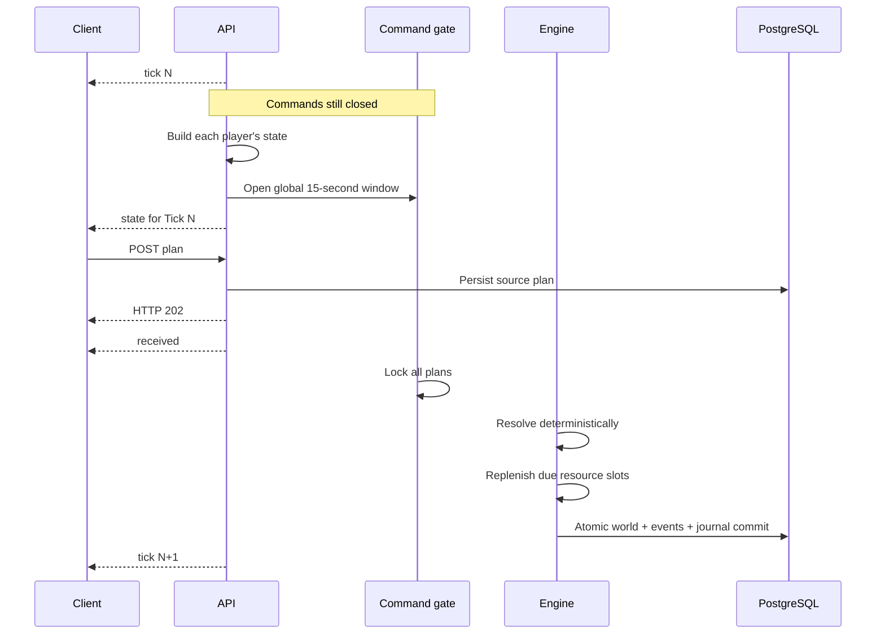

# World and Ticks

## One persistent world

- Every player shares one permanent world on a two-dimensional square grid.
- There are no seasons, no match resets, and no NPCs, monsters, or
  server-controlled fleets.
- An account owns at most one living Core at a time.
- Units, and each generation of a Core, get non-enumerable UUIDs. An object keeps
  its ID for as long as it lives, and no ID is ever reused after death.
- Every Core publishes its owner's username. Enemy state still never carries
  account IDs, email addresses, or Unit owner usernames.

An account that activates while the world is mid-resolution does not get spliced
into a half-built snapshot. Instead the server records a persistent
`activation_tick`, and the player enters through deterministic respawn processing
at that Tick like everyone else.

## Deterministic chunk generation

Terrain comes in 32×32 chunks, generated from a permanent secret world seed and a
versioned HMAC-SHA256 contract. Clients never see the seed.

That buys you a few guarantees worth relying on:

- The same world, generator version, balance, and coordinates always produce the
  same terrain.
- Neighboring chunks share deterministic boundary passages.
- Every passable pocket connects to the chunk backbone, though one-cell
  chokepoints are allowed and can matter strategically.
- `[0, 0]` and its route to the backbone are always `EMPTY`, so the Champion
  Beacon is never walled off.
- If the generator contract does not match, the service refuses to start.
  Changing generation semantics therefore means a new world database.

Obstacles and backbone passages are permanent terrain. Resource points are a
separate, consumable layer with a fixed quota per chunk; their replenishment is
also deterministic. See [Map and vision](./map-and-vision.md#resource-quotas) for
the quota and placement rules.

## Tick lifecycle

Every logical Tick has a fixed command phase followed by a resolution phase whose
length varies.

The window opens first, and only then does the server publish states one player
at a time. What reaches you is therefore whatever is **left** of that global 15
seconds; receiving `state` does not start a private timer of your own. The
protocol deliberately withholds `opened_at` and `deadline_at`.

Keep the two messages straight: `tick` only announces that a logical Tick exists,
with commands still closed. `state` is the one and only signal to act.

## Resolution order

This order is part of the protocol, not an implementation detail:

1. Lock the final valid Agent and Manual plans.
2. Resolve every `SELF_DESTRUCT`, remove those Units, and drop any Worker cargo
   on their final cells.
3. Charge upkeep from the remaining population and apply unpaid upkeep damage.
4. Resolve Unit movement, and Core migrations that reach their fourth Tick.
5. Validate new Core `START_MOVE` actions.
6. Resolve Champion Beacon pickup and drop actions.
7. Resolve Worker harvest and deposit actions.
8. Resolve Core spawn and shield repair.
9. Freeze one immutable combat snapshot and accumulate every legal attack.
10. Apply damage simultaneously, remove destroyed objects, and resolve any respawns
   that are due.
11. After every fourth resolved Tick, replenish only the consumed resource slots
    in each affected chunk back to that chunk's fixed quota.
12. Atomically commit the world, resource layer, events, statistics, journal, and
    new clock.
13. Announce the next Tick and prepare fresh private states.

The server never skips a Tick to catch up with wall-clock time; downtime simply
pauses the world. And two Ticks never resolve at the same time.

Resource replenishment belongs to the resolved Tick. A point consumed on a
replenishment Tick is removed first; the later replenishment step then fills the
chunk's missing slots. Existing unharvested points stay where they are, and unused
capacity never accumulates above the quota.

## Atomicity and replay

One Tick's result commits in a single PostgreSQL transaction, so there is no
window in which a client can observe a half-resolved world. The engine is also
forbidden from letting map iteration order, wall-clock time, process randomness,
or unordered query results decide an outcome.

Given the same world state and the same locked plans, the rules produce the same
result byte for byte.

## Crash recovery

| Failure point | Recovery |
|---|---|
| State preparation fails | Do not open the command window. |
| State publication fails | Abort the gate; reannounce the same Tick and reopen a full 15-second window after recovery. |
| Server crashes while OPEN | Keep persisted plans; on restart send the same `tick`, full `state`, latest receipts, and reopen a full window. |
| Server crashes after lock | Do not reopen; replay the persisted locked plans deterministically. |
| Server is offline | The world and all logical timers pause. |

## Existing-world transition

The consumable-resource release replaces the legacy resource layout in the
existing world. It does not reset the world clock, players, Cores, Units,
inventories, respawn status, or Champion Beacon state. Resource positions switch
to the new per-chunk quota and replenishment contract as a map-layer migration.

Rules v0.4 preserve Worker cargo as recoverable resource piles whenever a Worker
dies. Existing v0.1, v0.2, and v0.3 worlds upgrade at an `OPEN` or `COMMITTED`
boundary without resetting game state. A server stopped in `LOCKED` or
`RESOLVING` must finish that Tick under its old rules before upgrading.
