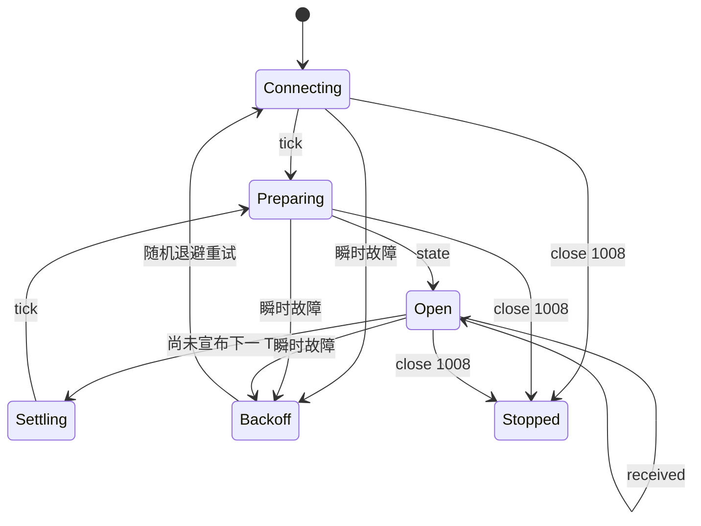

# 可靠的命令循环

## 客户端需要保存什么

下面这些值各存一份，互不混用：

```text
announced_tick
latest_state
latest_received.AGENT
latest_received.MANUAL
connection_phase
reconnect_attempt
terrain_memory
```

连接总有断的时候。最新状态和最新回执都在你自己手里，重连后直接整体换掉就行，
不用再去推断中间漏了什么。

## 状态机



结算 Tick 的时候，服务端可能一条业务消息都不发。这是正常现象，不是连接出了问题——
判断连接还活着靠的是协议级 Ping/Pong，WebSocket 库会替你处理。

## 决策时序

全服只有一个 15 秒窗口，而且它在服务端开始逐个发布状态之前就已经打开了。你永远
拿不到准确的截止时间，实际可用时间很可能不到 15 秒。

所以要给 POST 留出余量：

1. 可复用的索引和策略状态，在窗口外提前算好。
2. `state` 一到就开始算。
3. 给自己定一个明显短于 15 秒的内部截止时间。
4. 完整策略算不完，就先发一份简单的，别把窗口耗掉。
5. 看到 `COMMAND_WINDOW_CLOSED` 就收手，等下一份状态。

## 整体替换语义

假设你先提交这个：

```json
{
  "tick": 80,
  "unit_actions": {
    "aaaaaaaa-aaaa-4aaa-8aaa-aaaaaaaaaaaa": {"type": "MOVE", "direction": "UP"},
    "bbbbbbbb-bbbb-4bbb-8bbb-bbbbbbbbbbbb": {"type": "WAIT"}
  }
}
```

接着又提交这个：

```json
{
  "tick": 80,
  "unit_actions": {
    "aaaaaaaa-aaaa-4aaa-8aaa-aaaaaaaaaaaa": {"type": "MOVE", "direction": "LEFT"}
  }
}
```

那么 Unit B 就完全不在你的 Agent 计划里了。除非 Manual 给它动作，否则它结算为
`WAIT`——因为第二次提交是整份顶替第一份，服务端既不会合并两次请求，也不会把
Unit B 保留下来。

## 安全重试矩阵

| 结果 | 是否重试 | 行为 |
|---|---|---|
| 收到响应前网络失败 | 是 | 使用相同幂等键和完全相同的请求体重试。 |
| `202 Accepted` | 否 | 等待 `received`；计划已持久化。 |
| 相同幂等键重放 | 无额外效果 | 返回原响应，不重复广播 `received`。 |
| `TICK_NOT_READY` | 稍后 | 等待 `state` 或重连。 |
| `COMMAND_WINDOW_CLOSED` | 该 Tick 不重试 | 等待下一个 `state`。 |
| `TICK_MISMATCH` | 重新计算 | 绝不能只改旧计划中的 Tick 数字。 |
| `INVALID_COMMAND` | 修正一次 | 修正整份计划；旧的有效计划仍保持生效。 |
| `COMMAND_RATE_LIMITED` | 该来源/该 Tick 不重试 | 保留最新有效计划。 |
| `UNAUTHORIZED` 或 WS `1008` | 停止 | 修复凭证或客户端后再运行。 |

## 重连快照

在 OPEN 阶段重连，服务端会按这个顺序把该给的都给你：

1. 当前 `tick`；
2. 完整的当前 `state`；
3. `AGENT` 来源最新的 `received`（有的话）；
4. `MANUAL` 来源最新的 `received`（有的话）。

拿到这份快照就把本地值覆盖掉。注意重连并不能多争取时间，窗口按它自己的节奏走。

如果重连时状态还在准备，你会先拿到 `tick`，准备好之后再收到 `state`。如果重连
正好落在结算阶段，服务端会一直安静，直到下一个真实 Tick。

## 退避

从 250 ms 起步，每失败一次翻倍，涨到 5 秒就不再往上，并且叠加随机抖动。连接成功后
重置。关闭码 `1008` 是另一回事：它表示先别重试，把凭据或者引发问题的行为修好再说。

## 心跳

服务器每 20 秒发一次协议级 Ping，要求 60 秒内收到 Pong。标准 WebSocket 库会自动
帮你回。

不要自己造一个心跳 JSON 消息。这个连接不接受客户端业务帧，发了可能被以 `1008`
直接关掉。
