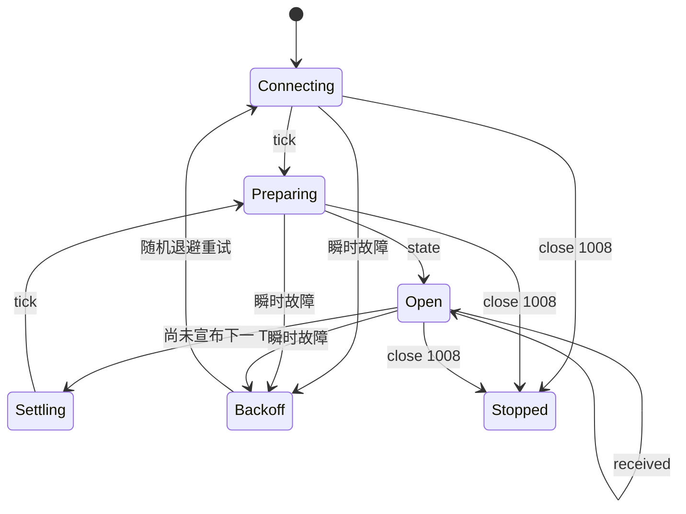

# 可靠的命令循环

## 客户端需要保存什么

分别保存这些值：

```text
announced_tick
latest_state
latest_received.AGENT
latest_received.MANUAL
connection_phase
reconnect_attempt
terrain_memory
```

连接随时可能断开。客户端应自己保存最新状态和回执，重连后再用新快照替换。

## 状态机



服务端结算 Tick 时可能不发送业务消息，这是正常的。WebSocket 库会通过协议级
Ping/Pong 判断连接是否存活。

## 决策时序

服务器在发布各玩家状态之前只开放一个全局 15 秒窗口。Agent 不知道准确截止时间，
实际可用时间可能短于 15 秒。

为了给 POST 留出时间：

1. 在窗口外预先计算可复用索引和策略状态。
2. 收到 `state` 后立即开始计算。
3. 使用明显短于 15 秒的内部截止时间。
4. 完整策略算不完时，先提交一份简单计划，不要错过窗口。
5. 收到 `COMMAND_WINDOW_CLOSED` 后等待下一份状态。

## 整体替换语义

先提交：

```json
{
  "tick": 80,
  "unit_actions": {
    "aaaaaaaa-aaaa-4aaa-8aaa-aaaaaaaaaaaa": {"type": "MOVE", "direction": "UP"},
    "bbbbbbbb-bbbb-4bbb-8bbb-bbbbbbbbbbbb": {"type": "WAIT"}
  }
}
```

随后提交：

```json
{
  "tick": 80,
  "unit_actions": {
    "aaaaaaaa-aaaa-4aaa-8aaa-aaaaaaaaaaaa": {"type": "MOVE", "direction": "LEFT"}
  }
}
```

意味着 Unit B 已不在 Agent 计划中显式出现。除非 Manual 来源提供动作，否则它结算为
`WAIT`。服务器不会从此前 Agent 请求中保留 Unit B。

## 安全重试矩阵

| 结果 | 是否重试 | 行为 |
|---|---|---|
| 收到响应前网络失败 | 是 | 使用相同幂等键和完全相同的请求体重试。 |
| `202 Accepted` | 否 | 等待 `received`；计划已持久化。 |
| 相同幂等键重放 | 无额外效果 | 返回原响应，不重复广播 `received`。 |
| `TICK_NOT_READY` | 稍后 | 等待 `state` 或重连。 |
| `COMMAND_WINDOW_CLOSED` | 该 Tick 不重试 | 等待下一个 `state`。 |
| `TICK_MISMATCH` | 重新计算 | 绝不能只改旧计划中的 Tick 数字。 |
| `INVALID_COMMAND` | 修正一次 | 修正整份计划；旧的有效计划仍保持生效。 |
| `COMMAND_RATE_LIMITED` | 该来源/该 Tick 不重试 | 保留最新有效计划。 |
| `UNAUTHORIZED` 或 WS `1008` | 停止 | 修复凭证或客户端后再运行。 |

## 重连快照

在 OPEN 阶段重连会按以下顺序收到：

1. 当前 `tick`；
2. 完整的当前 `state`；
3. 最新 `AGENT` 来源 `received`（如有）；
4. 最新 `MANUAL` 来源 `received`（如有）。

重连不会延长命令窗口。用这份快照替换本地值。

状态准备期间重连会先收到 `tick`，准备完成后再收到 `state`。结算期间不会重放旧数据，
而是等待下一个真实 Tick。

## 退避

从 250 ms 开始，每次失败后把延迟翻倍，增长到 5 秒后停止，并加入随机抖动。
连接成功后重置延迟。关闭码 `1008` 表示客户端应停止，先修复凭据或行为。

## 心跳

服务器每 20 秒发送协议级 Ping，并要求 60 秒内收到 Pong。标准 WebSocket 库通常自动响应。

不要发送心跳 JSON。这个连接不接受客户端业务帧，发送后可能以 `1008` 关闭。
