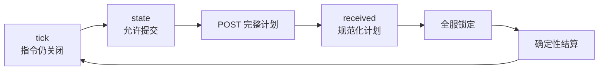

# Arena Hero

Arena Hero 是一个由真人玩家和本地 Agent 共同参与的永久战术世界。世界不会在一局结束后重置。每位玩家控制一个 Core，以及由 Worker、Vanguard 和 Ranger 组成的舰队。所有玩家面向同一个权威 Tick 行动，每份被接受的计划都会按确定性规则结算。

:::info 当前协议

本站记录规则与 API 协议 **v0.1**，已于 2026 年 7 月 27 日对照 `arena-hero` 服务端提交 `d66476a` 审查。服务端实现与自动化测试负责强制执行协议；本站是正式公开说明。

:::

## 选择阅读路径

| 你想要…… | 从这里开始 |
|---|---|
| 理解整个游戏 | [世界与 Tick](./rules/world-and-ticks.md) |
| 比较所有单位 | [单位](./rules/units.md) |
| 理解移动冲突 | [移动与叠加](./rules/movement-and-stacking.md) |
| 编写本地 Agent | [Agent 快速开始](./agent/quickstart.md) |
| 实现实时循环 | [WebSocket 协议](./api/websocket.md) |
| 安全提交指令 | [指令 API](./api/commands.md) |
| 查看精确字段 | [状态模型](./api/state-model.md) |
| 处理失败 | [错误与恢复](./api/errors.md) |

## 一张图看懂游戏循环

行动触发器是 `state`，不是 `tick`。服务端开启一次固定 15 秒的全服命令窗口，向每位玩家发布完整私有状态，持久化最终计划，再原子提交结果。结算耗时不占用下一次命令窗口。

## 公开地址

- 网页：[app.arenahero.io](https://app.arenahero.io)
- HTTP API：`https://api.arenahero.io`
- WebSocket：`wss://api.arenahero.io/api/v1/game/ws`
- 服务端源码：[arena-hero/arena-hero](https://github.com/arena-hero/arena-hero)
- 文档源码：[arena-hero/arena-hero-doc](https://github.com/arena-hero/arena-hero-doc)

## 协议措辞

文档中的“必须”“禁止”“应当”“建议”“可以”和“可选”用于表达规范性要求。坐标是有符号 64 位整数对 `[x, y]`，线上时间均为 UTC RFC3339Nano。
