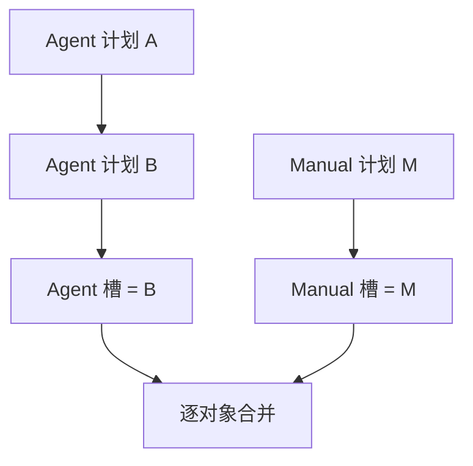

# 指令与优先级

## 两个独立来源槽

每位玩家每个 Tick 有一个 `AGENT` 计划槽和一个 `MANUAL` 计划槽，逐对象合并：

```text
Manual 显式动作 > Agent 显式动作 > WAIT
```

- Agent 计划放的是自动动作。没写到的对象按 `WAIT` 处理，除非 Manual 那边给了动作。
- Manual 计划放的是人工覆盖。没写到的对象回退成 Agent 的动作。
- 想让某个 Agent 动作停下来，Manual 必须显式发一个 `WAIT`，光是不写它是不够的。
- 同一玩家所有的 Agent 客户端共用一个 Agent 槽。
- 同一玩家所有的网页标签共用一个 Manual 槽。

## 后一次计划会替换前一次

同一来源每次提交成功，都会把之前那份整个换掉。服务端从不 patch，也不 merge。



所以 Agent 如果只想改一个 Unit、其他 Unit 保持原样，那些动作也得跟着一起再发一遍。

## 静态与动态校验

静态检查在持久化之前跑，看这些：

- body 是一个 JSON object，没有未知字段；
- Tick 是正数；
- Unit 的 key 是小写、带连字符的 UUID；
- 引用到的行动 Unit 都属于这名玩家；
- 动作类型适用于该 Unit；
- 必需字段都在，无关字段都不在。

只要有一处不对，整份请求就被原子拒绝，你之前那份有效计划原封不动。

动态条件是另一回事，它们只能等到结算时才见分晓：

- 目标移动了；
- 目的格被占满了；
- 移动被争夺；
- 资源不够了；
- Beacon 被更小的 UUID 抢走；
- Ranger 的射线被挡住。

这些都不会让你的 POST 作废，它们会出现在下一条 `state.events` 里。

## 顺序与限制

同一个 `(player, tick, source)` 的有效请求，按进入 gate 的先后顺序串行处理，后存的
计划盖掉先存的。协议里没有客户端提供的版本号。

每个来源槽每 Tick 最多接受 64 个新提交，计数发生在幂等预查之后——有效的和静态非法的
都算。再多就是 `429 COMMAND_RATE_LIMITED`，你最后那份有效计划不受影响。

## 幂等与回执

每个命令请求都带 `Idempotency-Key`。

- 同 key 同 body：把原来那个 HTTP 响应再给你一次。
- 同 key 不同 body：`IDEMPOTENCY_CONFLICT`。
- 幂等重放不会再广播一条 `received`。

服务端存下新计划之后：

1. HTTP 返回一个精简的 `202 Accepted`，带回执元数据。
2. 这名玩家所有在线连接都会在 `received.plan` 里收到服务端存下的那份计划。
3. 在同一个 OPEN Tick 内重连，会恢复每个来源最新的回执。

回执在下一个 Tick 开始时清空。它不是一个查计划历史的服务。
