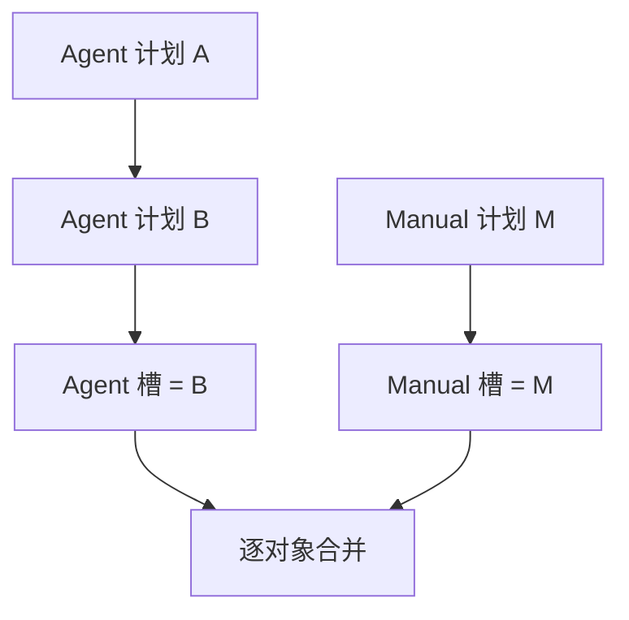

# 指令与优先级

## 两个独立来源槽

每位玩家每 Tick 有一个 `AGENT` 计划槽和一个 `MANUAL` 计划槽：

```text
Manual 显式动作 > Agent 显式动作 > WAIT
```

- Agent 计划是完整自动计划；Agent 未列出的对象默认 `WAIT`，除非 Manual 有显式动作。
- Manual 是完整人工覆盖集合；未列出的对象回退到 Agent。
- Manual 必须显式 `WAIT` 才能强制对象不行动。
- 同一玩家的所有 Agent 客户端共享同一 Agent 槽，多个网页标签共享同一 Manual 槽。

## 完整替换

同来源每次成功 POST 都完整替换上一份计划，服务端从不 patch 或 merge。



若 Agent 只想修改一个 Unit 但保留其他动作，仍必须重新发送完整期望计划。

## 静态与动态校验

持久化前静态检查：

- 严格单一 JSON 对象且无未知字段；
- Tick 为正；
- Unit key 是规范小写 UUID；
- 所有行动 Unit 属于玩家；
- 动作适用于该 Unit；
- 必需字段存在、无关字段不存在。

任一问题都会原子拒绝整份请求，旧有效计划不变。

目标移动、目的格占据、争夺、资源不足、Beacon 竞争、射线阻挡等动态条件在全局结算时判断。动态失败不否定 POST，会进入下一 `state.events`。

## 顺序与限制

同一 `(player, tick, source)` 的有效请求按进入 gate 的顺序串行处理，后持久化的完整计划覆盖前者。协议没有客户端版本号。

每个来源槽每 Tick 最多处理 64 个通过幂等预查的新请求；有效与静态非法都计数。超限返回 `429 COMMAND_RATE_LIMITED`，最后有效计划保持不变。

## 幂等与回执

- 相同 key + 相同 body：返回原 HTTP 响应。
- 相同 key + 不同 body：`IDEMPOTENCY_CONFLICT`。
- 幂等重放不会再次广播 `received`。

新计划成功持久化后，HTTP 返回最小 `202` 元数据；玩家所有实时连接收到完整规范化 `received.plan`。当前 Tick 重连会恢复每个来源最新回执，新 Tick 开始即清空，它不是计划历史。
