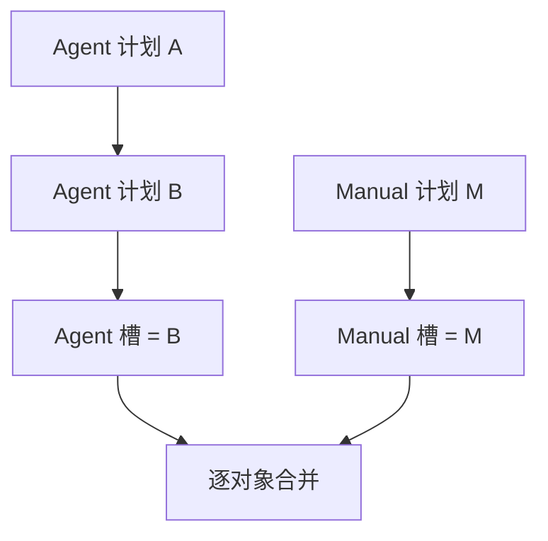

# 指令与优先级

## 两个独立来源槽

每位玩家每 Tick 有一个 `AGENT` 计划槽和一个 `MANUAL` 计划槽：

```text
Manual 显式动作 > Agent 显式动作 > WAIT
```

- Agent 计划包含自动动作。没写的对象使用 `WAIT`，除非 Manual 给了动作。
- Manual 计划包含人工覆盖。没写的对象回退到 Agent 动作。
- 玩家想阻止 Agent 动作时，Manual 需要明确发送 `WAIT`。
- 同一玩家的所有 Agent 客户端共享同一 Agent 槽，多个网页标签共享同一 Manual 槽。

## 后一次计划会替换前一次

同一来源后提交成功的计划会替换前一份。服务端不会把新旧计划 patch 或 merge。



如果 Agent 只想修改一个 Unit，同时保留其他动作，必须把其他动作再发送一次。

## 静态与动态校验

持久化前静态检查：

- 一个 JSON object，且不能有未知字段；
- Tick 为正；
- Unit key 是小写、带连字符的 UUID；
- 所有行动 Unit 属于玩家；
- 动作适用于该 Unit；
- 必需字段存在、无关字段不存在。

任一问题都会原子拒绝整份请求，旧有效计划不变。

目标移动、目的格占据、争夺、资源不足、Beacon 竞争、射线阻挡等动态条件在全局结算时判断。动态失败不否定 POST，会进入下一 `state.events`。

## 顺序与限制

同一 `(player, tick, source)` 的有效请求按进入 gate 的顺序处理，后保存的计划覆盖前者。
协议没有客户端版本号。

每个来源槽每 Tick 最多处理 64 个通过幂等预查的新请求；有效与静态非法都计数。超限返回 `429 COMMAND_RATE_LIMITED`，最后有效计划保持不变。

## 幂等与回执

- 相同 key + 相同 body：返回原 HTTP 响应。
- 相同 key + 不同 body：`IDEMPOTENCY_CONFLICT`。
- 幂等重放不会再次广播 `received`。

计划保存成功后，HTTP 返回精简的 `202` 元数据，玩家所有在线连接都会在
`received.plan` 中收到服务端保存的计划。当前 Tick 重连时会恢复每个来源的最新回执；
新 Tick 开始后会清空。这不是计划历史。
