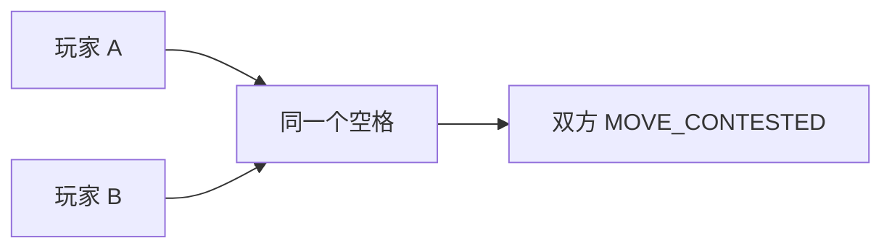

# 移动与叠加

## 基础限制

- Unit 每 Tick 最多移动一格。
- 只能走四个正方向：`UP`、`DOWN`、`LEFT`、`RIGHT`。
- 移动会用掉 Unit 的动作，所以这个 Tick 它不能再攻击或者干活。
- 障碍阻挡一切移动。
- 资源格接受 Unit，但不接受迁移中的 Core。
- 每格最多容纳**两个可占位实体**；Core、Worker、Vanguard、Ranger 各算一个。
- 不同玩家的对象绝不能在 Tick 结束时停在同一格。

移动不是一条请求一条请求地处理的。引擎会建一张全局依赖图，把所有 Unit 移动和所有
到期的 Core 迁移一次算完。

## 争夺目的格

两个玩家想进同一格，两边都会失败。什么都打不破这个平局：舰队大小、谁先提交、
命令来自哪个来源，都不算。



但如果争的是同一个玩家自己的对象，规则不一样：位置不够时，按对象 UUID 原始字节
升序，谁小谁进，剩下的以 `CELL_UNIT_LIMIT` 失败。这条规则确定，但别拿它当战术用——
按你预期的容量来排计划。

## 已占据目的格

只要原来的占据者全部成功离开、最终容量也算得过来，你就能进这一格。移动链就是这么
成立的：

```text
A → B 的原格
B → C 的原格
C → 空格
```

C 能走通，整条链就都能走通；中间任何一环走不掉，失败就往前一路传回去。

有一点要记住：如果一格上是同一个玩家的两个对象，那两个都得离开，敌人才进得来。

## 交换与环

不同玩家的两个对象想沿同一条边换位置，永远失败：

```text
A [0,0] → [1,0]
B [1,0] → [0,0]
```

三个位置以上的闭环则可以成功，前提是每个最终格的 owner 和容量都说得通。在四方向
方格上，你实际会遇到的最短环是四格。

## Core 参与

走到第 4 个 Tick 的 Core 迁移，会带着真实移动意图进入同一张依赖图。而静止的 Core
就是一个敌人进不来的占据者。

第 4 Tick 的这次位移仍然可能失败，原因包括：

- 地形不可通行；
- 有符号坐标溢出；
- 原占据者没有离开；
- 目的格被争夺；
- 敌人同时要进这一格；
- 最终容量不够。

失败后 Core 留在原来的位置，迁移进度清零。

## 网页路线不是服务端规则

在网页里你可以点一个远处已探索的格子并得到一条路线，但这条路线纯粹是本地的 Manual
自动化：每收到一份新 `state`，浏览器就重算一次，并且只提交下一步。服务端只接受
`MOVE` 和 `START_MOVE`，从不接受多格路径。

网页一关，路线也就跟着停了。
