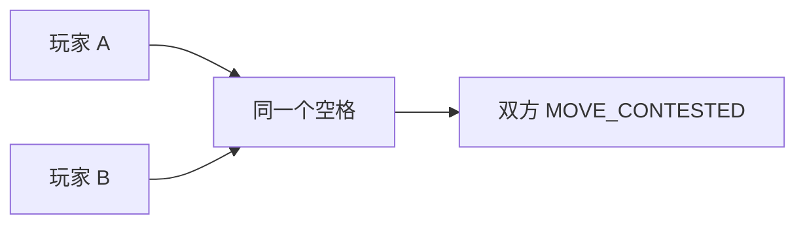

# 移动与叠加

## 基础限制

- Unit 每 Tick 最多移动一格。
- 只能 `UP`、`DOWN`、`LEFT`、`RIGHT`。
- 移动占用 Unit 动作，本 Tick 不能再攻击或工作。
- 障碍阻挡所有移动。
- 资源格允许 Unit，但不允许 Core 迁入。
- 每格最多容纳**两个可占位实体**；Core、Worker、Vanguard、Ranger 各算一个。
- 不同玩家对象不能在 Tick 结束时同格。

引擎不会按请求顺序处理移动，而是建立一个全局依赖图，一次决定全部 Unit 移动和到期 Core 迁移。

## 争夺目的格

不同玩家同时进入同一目的格时全部失败。舰队数量、提交时间和来源优先级都不能打破平局。



同一玩家多个对象争夺不足的空位时，按对象 UUID 原始字节升序分配，其余 `CELL_UNIT_LIMIT`。这是确定性规则，不应当依赖它做时序技巧。

## 已占据目的格

若原占据者全部成功离开，且最终容量合法，其他对象可以进入，由此形成移动链：

```text
A → B 的原格
B → C 的原格
C → 空格
```

只要 C 成功，整条链可以成功；任一依赖无法离开，失败向前传播。若一格原有同一玩家两个对象，敌人进入前两者都必须成功离开。

## 交换与环

不同玩家沿同一条边双向交换永远失败：

```text
A [0,0] → [1,0]
B [1,0] → [0,0]
```

三个以上位置组成的合法闭环可以成功，只要最终所有格满足 owner 与容量。四方向方格中常见最短环为四格。

## Core 参与

达到第 4 Tick 的 Core 迁移以真实移动意图进入同一依赖图；静止 Core 是敌人不能进入的占据者。

迁移可能因地形、坐标溢出、原占据者未离开、目的格争夺、敌人同时进入或容量失败。失败后 Core 留在原格并清零迁移进度。

## 网页路线不是服务端规则

网页可以选择远处已探索目的地并寻路，但路线只是本地 Manual 自动化：每次新 `state` 后重新计算，只提交下一步。服务端只接受单步 `MOVE` / `START_MOVE`，从不接受多格路径。

关闭网页后，路线不会自行继续。
