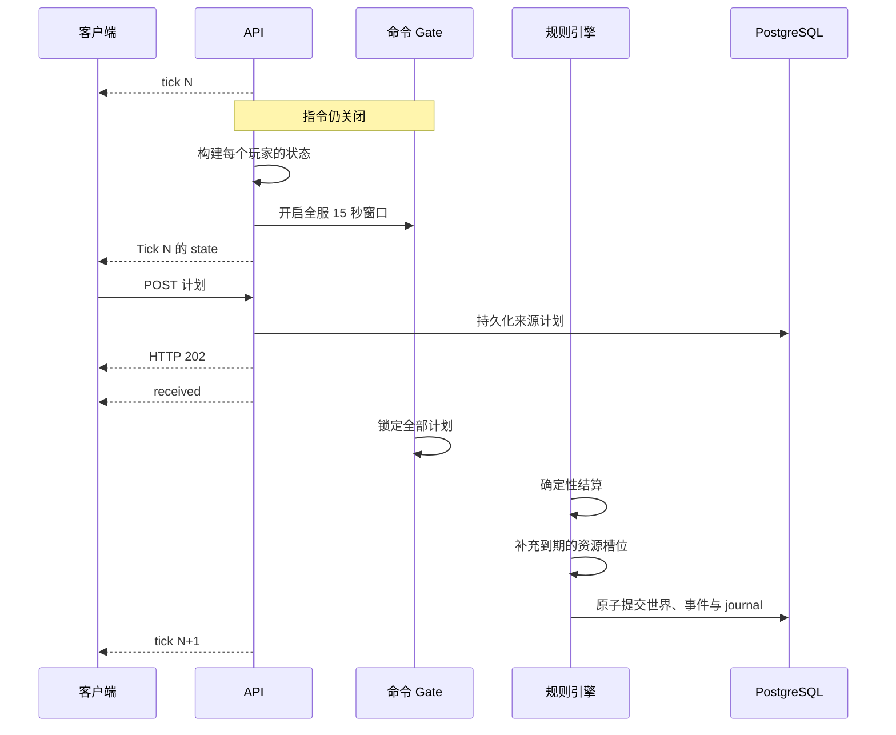

# 世界与 Tick

## 一个永久世界

- 所有玩家共享同一个永久运行的二维方格世界。
- 没有赛季，没有对局重置，也没有 NPC、野怪或服务器舰队。
- 每个账号同一时间最多拥有一个存活的 Core。
- Unit 和每一代 Core 使用不可枚举的 UUID。对象活着的时候 ID 一直不变，死亡之后
  这个 ID 永不复用。
- 敌方状态里绝不会带上账号 ID、邮箱或者 username。
- v0.1 没有公开排行榜。

如果一个账号正好在世界结算期间激活，它不会被塞进一份没做完的快照里。服务端会给它
记一个持久的 `activation_tick`，玩家在那个 Tick 走确定性重生流程进入世界，和其他人
一样。

## 确定性区块生成

地形以 32×32 区块为单位，由一个永久保密的 world seed 加上版本化的 HMAC-SHA256 协议
生成，客户端永远拿不到 seed。

这给了你几条可以放心依赖的保证：

- 世界、生成器版本、平衡参数和坐标都相同，地形就一定相同。
- 相邻区块之间的边界通道是确定性的。
- 任何可通行区域都连到区块主干上；但允许出现一格宽的瓶颈，而且这种地形往往很关键。
- `[0, 0]` 以及它通往主干的那条路永久是 `EMPTY`，所以 Champion Beacon 不会被围死。
- 生成器协议对不上，服务直接拒绝启动。也就是说改动生成语义就得换一个世界数据库。

障碍和主干通道属于永久地形。资源点则是另一层可消耗地图数据，每个区块都有固定配额，
补充位置同样按确定性规则生成。配额和放置规则见
[地图与视野](./map-and-vision.md#resource-quotas)。

## Tick 生命周期

每个逻辑 Tick 都是固定长度的命令阶段，加上一段长短不固定的结算阶段。

窗口先开，之后服务端才逐个发布玩家状态。所以你拿到手的，是那 15 秒里**还剩下的
那部分**；收到 `state` 并不会给你单独起一个 15 秒计时。协议也故意不公开
`opened_at` 和 `deadline_at`。

两条消息别搞混：`tick` 只是宣布有这么一个逻辑 Tick，此时命令还没开放；`state` 才是
唯一的行动信号。

## 结算顺序

下面这个顺序属于协议的一部分，不是实现细节：

1. 锁定最终有效的 Agent 与 Manual 计划。
2. 结算所有 `SELF_DESTRUCT`，立即移除这些 Unit，并把 Worker Cargo 掉在最后所在格。
3. 按剩余人口扣维护费，并应用欠费伤害。
4. 结算 Unit 移动，以及走到第 4 个 Tick 的 Core 迁移。
5. 检查新提交的 Core `START_MOVE`。
6. 结算 Champion Beacon 的拾取与放下。
7. 结算 Worker 的采集与交付。
8. 结算 Core 的生产与修盾。
9. 冻结不可变战斗快照，累计所有合法攻击。
10. 同时应用伤害，移除死亡对象，并处理到期的重生。
11. 每结算满 4 个 Tick，按区块只补回已经消耗的资源槽位，使可用资源总数回到该区块的
    固定配额。
12. 原子提交世界、资源层、事件、统计、journal 和新时钟。
13. 宣布下一个 Tick，并准备新的私有状态。

服务端不会为了追上墙上时间而跳 Tick，停服期间世界就是暂停。两个 Tick 也绝不会同时
结算。

资源补充属于本 Tick 的结算末尾。在补充 Tick 里被采掉的点会先消失，随后补充步骤再填满
区块缺少的槽位。没被采的点不会移动，没用掉的配额也不会累计到上限以上。

## 原子性与重放

一个 Tick 的结果在同一个 PostgreSQL 事务里提交，所以客户端不存在看到「结算了一半的
世界」的时机。规则引擎同样不允许用 map 遍历顺序、墙上时间、进程随机数或者无序的查询
结果去决定胜负。

世界状态和锁定计划都相同，规则算出来的结果就逐字节相同。

## 崩溃恢复

| 故障点 | 恢复方式 |
|---|---|
| 状态准备失败 | 不开启命令窗口。 |
| 状态发布失败 | 中止 gate；恢复后重新宣布同一 Tick 并重开完整 15 秒。 |
| OPEN 阶段崩溃 | 保留已持久化计划；重启后发送同一 `tick`、完整 `state` 和最新回执，并重开完整窗口。 |
| 锁定后崩溃 | 不重新开放窗口，确定性重放已锁定计划。 |
| 服务离线 | 世界和所有逻辑计时暂停。 |

## 现有世界切换

可消耗资源版本会替换现有世界的旧资源布局，但不会重置世界时钟、玩家、Core、Unit、
库存、重生状态或 Champion Beacon 状态。资源位置作为地图层迁移到新的区块配额与补充
协议。

规则 v0.4 让 Worker 死亡时的 Cargo 作为可回收资源堆留在原地。现有 v0.1 / v0.2 /
v0.3 世界可以在 `OPEN` 或 `COMMITTED` 边界升级，不会重置游戏状态。如果旧服务停在
`LOCKED` 或 `RESOLVING`，必须先用旧规则完成该 Tick，才能升级。
