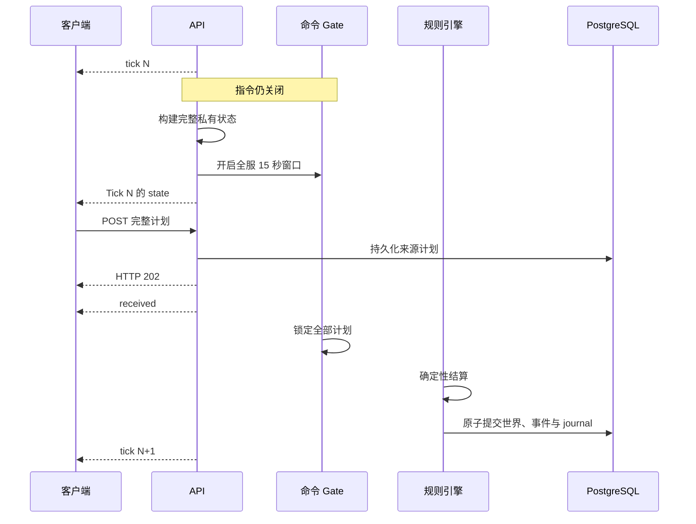

# 世界与 Tick

## 一个永久世界

- 所有玩家共享同一个永久运行的二维方格世界。
- 没有赛季、对局重置、NPC、野怪或服务器舰队。
- 每个账号同时最多拥有一个存活 Core。
- Unit 和每一代 Core 使用不可枚举 UUID。对象存活期间 ID 稳定，死亡后永不复用。
- 敌方状态不暴露账号 ID、邮箱或 username。
- v0.1 没有公开排行榜。

在世界结算期间激活的账号不会插入半成品快照。服务端持久化 `activation_tick`，玩家在该 Tick 的确定性重生阶段进入世界。

## 确定性无限生成

服务端使用永久秘密 world seed 和版本化 HMAC-SHA256 协议生成 32×32 区块，客户端永远得不到 seed。

- 同一世界、生成器版本、平衡参数和坐标永远产生相同地形。
- 相邻区块共享确定性边界通道。
- 所有可通行区域连接区块主干，但允许一格宽瓶颈。
- `[0, 0]` 及其连接主干的通道永久为 `EMPTY`，确保 Champion Beacon 全图可达。
- 生成器协议不匹配会阻止服务启动。改变生成语义需要新世界数据库。

## Tick 生命周期

每个逻辑 Tick 包含固定命令阶段和可变结算阶段。

服务端在逐个发布玩家状态之前开启全服窗口。因此客户端拿到的是全服 15 秒中**剩余的部分**；收到 `state` 不会启动个人 15 秒计时器。协议也不会公开 `opened_at` 或 `deadline_at`。

`tick` 只宣布逻辑 Tick 已存在，此时命令仍关闭；`state` 才是唯一行动触发器。

## 结算顺序

以下顺序属于协议：

1. 锁定最终有效的 Agent 与 Manual 计划。
2. 扣维护费并应用欠费伤害。
3. 结算 Unit 移动和达到第 4 Tick 的 Core 迁移。
4. 检查新的 Core `START_MOVE`。
5. 结算 Champion Beacon 拾取与放下。
6. 结算 Worker 采集与交付。
7. 结算 Core 生产与修盾。
8. 冻结不可变战斗快照，累计所有合法攻击。
9. 同时应用伤害，移除死亡对象并处理到期重生。
10. 原子提交世界、事件、journal 和新时钟。
11. 宣布下一 Tick 并准备新的私有状态。

服务端不会为了追赶墙上时间而跳 Tick。停服期间世界暂停，也不会并行结算两个 Tick。

## 原子性与重放

一个 Tick 的结果在一个 PostgreSQL 事务中提交。客户端不能看到部分结算的世界。规则引擎不得使用 map 遍历顺序、墙上时间、进程随机数或无序数据库结果决定胜负。

相同权威世界和相同锁定计划必须产生逐字节一致的规则结果。

## 崩溃恢复

| 故障点 | 恢复方式 |
|---|---|
| 状态准备失败 | 不开启命令窗口。 |
| 状态发布失败 | 中止 gate；恢复后重新宣布同一 Tick 并重开完整 15 秒。 |
| OPEN 阶段崩溃 | 保留已持久化计划；重启后发送同一 `tick`、完整 `state` 和最新回执，并重开完整窗口。 |
| 锁定后崩溃 | 不重新开放窗口，确定性重放已锁定计划。 |
| 服务离线 | 世界和所有逻辑计时暂停。 |
